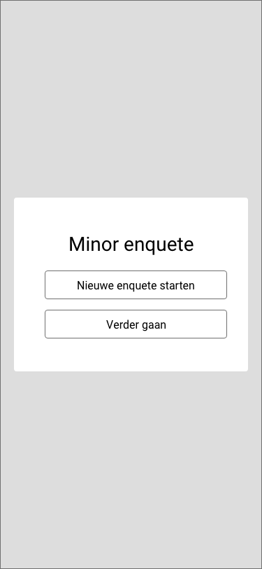
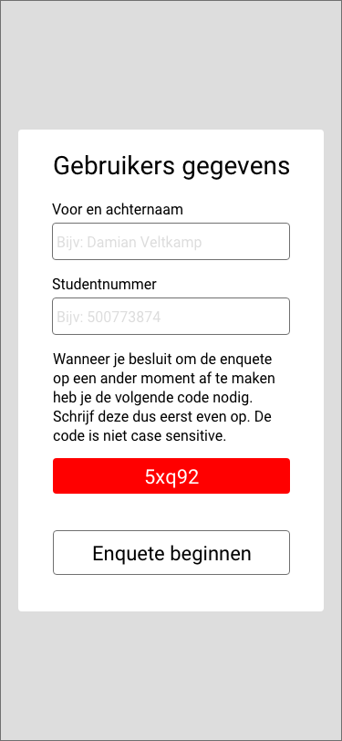
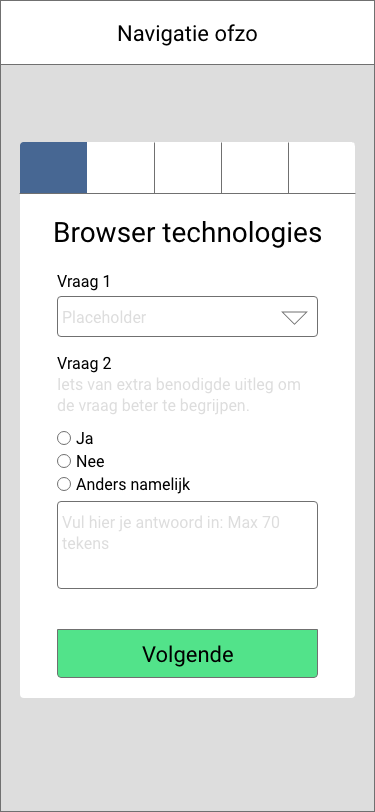
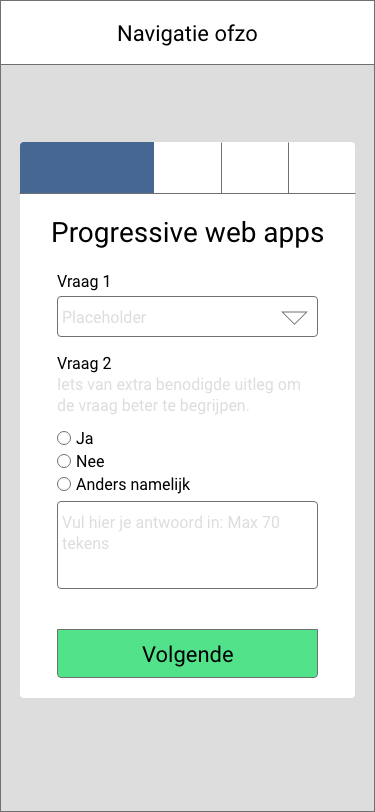
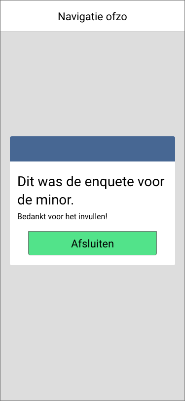
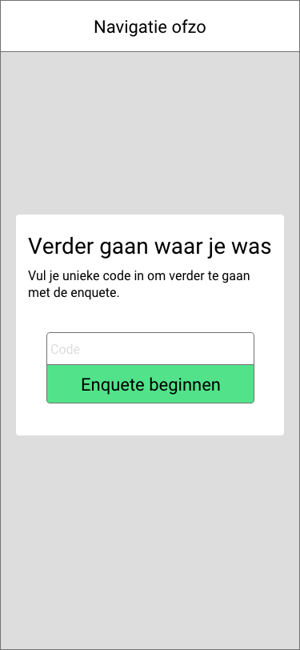
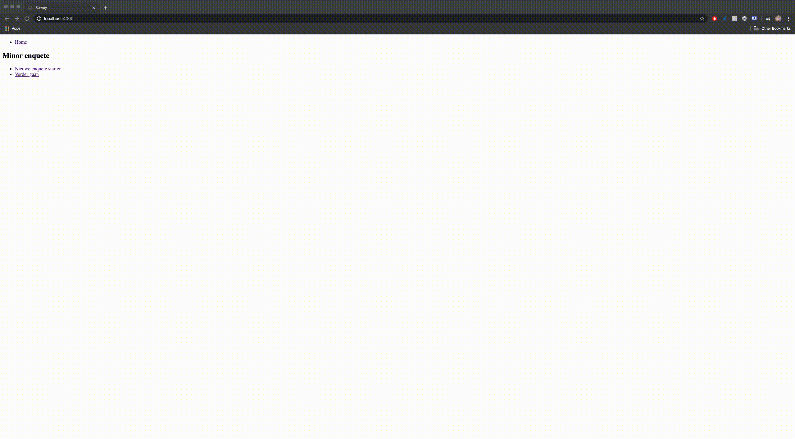
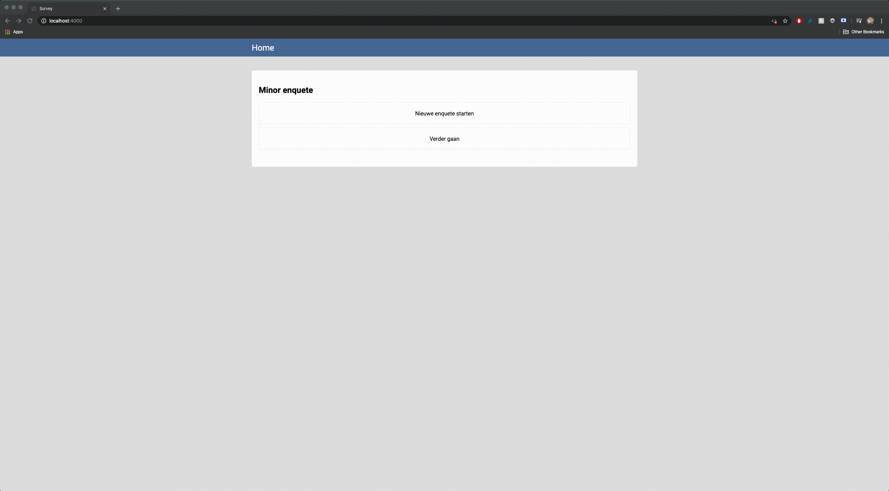

# Browser Technologies @cmda-minor-web 1920
Repository for the browser technologies course.
[DEMO](https://sleepy-anchorage-02272.herokuapp.com/)

## Table of contents
* [Description](#description)
* [Todo](#todo)
* [Wireframes](#wireframes)
* [Functional layer](#functional-layer)
* [Usable layer](#usable-layer)
* [Pleasurabel layer](#pleasurable-layer)
* [Browser testing](#browser-testing)
* [Prerequisites](#prerequisites)
* [Installing](#installing)

## Description
**Case:**
"Ik wil een enquete kunnen invullen over de minor Web Development, met verschillende antwoord mogelijkheden. Als ik de enquete niet afkrijg, wil ik later weer verder gaan met waar ik ben gebleven."

**Werking van de applicatie:**
Wanneer de gebruiker aankomt op de site krijgt hij de mogelijkheid om een nieuwe enquete te starten of door te gaan met een enquete die hij/zij eerder gestart heeft. Wanneer de gebruiker kiest om een nieuwe enquete te starten krijgt de gebruiker een unieke code waarmee hij zichzelf kan identificeren zodat als hij de enquete op een ander moment af wilt maken hij dit kan doen doormiddel van de unieke code.

## Todo
* Backwards navigation functionality for the survey form
* Progress bar animating
* Form validation
* Form input feedback
* Disabeling previous survey form when fetching next question via XML

## Wireframes

### Start screen

<details>
  <summary>Bekijk wireframe</summary>
  
</details>

### Userinformation screen

<details>
  <summary>Bekijk wireframe</summary>
  
</details>

### Enquete form step 1

<details>
  <summary>Bekijk wireframe</summary>
  
</details>

### Enquete form step 2

<details>
  <summary>Bekijk wireframe</summary>
  
</details>

### Enquete finished

<details>
  <summary>Bekijk wireframe</summary>
  
</details>

### Continue where you left off screen

<details>
  <summary>Bekijk wireframe</summary>
  
</details>

## Functional layer
In de functional laag is alleen de core functionaliteit te zien. In deze laag is geen javascript en geen css toegepast. Alles wordt op de server afgehandeld en de content wordt aan de hand van form POST requests opgevraagd en opgeslagen.
De enquete wordt per stap opgeslagen op de server in een json bestand. De gebruiker krijgt aan het begin van de enquete een unieke code die hij/zij later kan gebruiken om verder te gaan met de enquete.

<details>
  <summary>Bekijk functional layer</summary>
  
</details>

## Usable layer
In de usable layer is de css toegevoegd en is het 10x makkelijker om de applicatie te gebruiken. Elementen hebben een duidelijk contrast tot elkaar en er wordt doormiddel van grote en kleur aandacht gevestigd op de belangrijke elementen op de pagina.
<details>
  <summary>Bekijk usable layer</summary>
  
</details>

### Code snippets voor het schrijven van css falbacks
<details>
  <summary>Bekijk code snipets</summary>

#### Uitleg fallback voor kleuren
  Voor dit project heb ik ervoor gekozen om hele simpele css te schrijven zodat de styling voor elke browser ondersteund wordt, ik heb dus niet gebruik gemaakt
  van bijvoorbeeld een display grid of flex oplossing om mijn layout te maken. Wel heb ik gebruik gemaakt van css variabelen voor mijn kleuren.
  Dit wordt niet door elke browser ondersteund en heb ik op de onderstaande manier ervoor gezorgt dat wel de kleur getoond wordt, dit is mogelijk door het cascading effect van css.
  Eerst wordt de hex kleur toegevoegd aan het element en daarna wordt wanneer de css variabelen ondersteund zijn door de browser de variabele kleur toegevoegd.

  ```css
  background: #476793;
  background: var(--primary-color)
  ```

#### Uitleg supports and supports not
  Omdat ik voor dit project niet gebruik heb gemaakt van nieuwe minder goed ondersteunde css technieken leg ik hier een stuk uit over hoe ik dit wel afgevangen zou hebben wanneer ik wel voor een display grid gekozen zou hebben.
  Door gebruik te maken van de @supports en @supports not kan je op een makkelijke manier detecteren of een browser wel of niet een feature support. Hiermee kan je dus fallbacks schrijven voor bijvoorbeeld een display grid of display flex.
  Dit doe je op de volgende manier.

  ```css
  @supports (display: grid) {
  #form-watcher {
    display: grid;
    /* Layout styling here when grid is supported */
    }
  }

  @supports not (display: grid) {
  #form-watcher {
    display: inline-block;
    /* Fallback layout styling here when grid is not supported */
    }
  }
  ```

  In scss is het nog makkelijker om een supports te schrijven omdat je in scss kan nesten en dus de code bij elkaar houdt en niet meer ergens onderaan je document de supports te schrijven.
  Dit is voor de leesbaarheid van je code stukken beter in mijn mening.

  ```scss
  #form-watcher {
    /* Standard layout styling that is supported by every browser goed here */

    @supports (display: grid) {
      display: grid;
      /* Layout styling here when gris is supported */
    }
  }
  ```


</details>

## Pleasurable layer
In de pleasurable layer heb ik met javascript op de client ervoor gezorgd dat de browser niet bij form submit een refresh hoeft te doen. Ik handel nu de POST af in de client en doe dit doormiddel van AJAX XMLHttpRequest.
Door dit te doen kan ik de content doormiddel van een animatie het beeld in en uit laten faden en zorgt dit voor een meer plezierige ervaring voor de gebruiker.
<details>
  <summary>Bekijk pleasurable layer</summary>
  
</details>

### Code snippets voor afhandelen XMLHttpRequest
<details>
  <summary>Bekijk code snippets</summary>

#### Uitleg form afhandeling
  In dit stuk code selecteer ik alle formulieren die in het document staan, vervolgens kijk ik of er formulieren zijn en ga ik voor elk formulier de
  input fields en hun value's ophalen. Vervolgens push ik in FORMDATA de name van de node en de value die de node heeft, dit heb ik nodig on een query string te sturen
  naar de server. Vervolgens doe ik een feature detection op  XHR en stuur ik de query string naar mijn server en insert ik de html response in mijn form container.

  ```javascript
  if(mutationObserver) {
    const SURVEYFORM = document.querySelectorAll('form[name="survey"]')
    if(SURVEYFORM) {
      SURVEYFORM.forEach(form => {
        form.addEventListener('submit', (event) => {
          event.preventDefault()
          const FORMDATA = [],
            RADIOFIELDS = form.querySelectorAll('input[type="radio"]'),
            RANGES = form.querySelectorAll('input[type="range"]'),
            TEXTAREAS = form.querySelectorAll('textarea'),
            HIDDENFIELDS = form.querySelectorAll('input[type="hidden"]')

          if(RADIOFIELDS) {
            const checkedRadios = [...RADIOFIELDS].filter(node => {
              return (node.checked)
            })
            checkedRadios.forEach(node=> {
              FORMDATA.push(`${node.name}=${node.value}`)
            })
          }

          if(TEXTAREAS) {
            const textAreas = [...TEXTAREAS].forEach(node => {
              FORMDATA.push(`${node.name}=${node.value}`)
            })
          }

          if(RANGES) {
            const ranges = [...RANGES].forEach(node => {
              FORMDATA.push(`${node.name}=${node.value}`)
            })
          }

          if(HIDDENFIELDS) {
            const hiddenFields = [...HIDDENFIELDS].forEach(node => {
              FORMDATA.push(`${node.name}=${node.value}`)
            })
          }

          const QUERY = FORMDATA.join('&'),
            XHR = new XMLHttpRequest()

          if(XHR) {

            XHR.onload = () => {
              const SURVEYCONTAINER = document.getElementById('forms'),
                formSections = SURVEYCONTAINER.querySelectorAll('section')

              SURVEYCONTAINER.setAttribute('style', `left: -${(formSections.length * 100)}%;`)
              SURVEYCONTAINER.insertAdjacentHTML('beforeend',XHR.response)
            }

            XHR.open('POST', `${window.location.origin}/survey`)
            XHR.setRequestHeader('Content-type', 'application/x-www-form-urlencoded')
            XHR.send(`${QUERY}&xhr=true`)

          }

        })
      })
    }
  }
  ```

#### Uitleg mutationObserver
  Nu kon ik met de server praten vanuit de client, echter wanneer ik nu een nieuw formulier insert in de container wordt het submit event niet toegevoegd aan het formulier, om
  dit op te lossen heb ik gezocht naar een manier om mutaties in mijn dom structuur te observeren. Dit doe ik door gebruik te maken van de MutationObserver api.
  In het onderstaande stuk code is te zien dat ik op mijn form-watcher container kijk of de subtree, childlist en characterData aangepast wordt.
  Als dit het geval is wordt de formSubmitHandler functie aangeroepen en zal dus het submit event toegevoegd worden aan het nieuwe form. Voor mutationObserver heb ik geen
  goed alternatief kunnen vinden, wanneer mutationObserver dus niet ondersteund wordt zal de clientside code niet uitgevoerd worden en zal het op normale manier op de server
  afgehandeld worden.

  ```javascript
  const mutationObserver = new MutationObserver((mutations) => {
    formSubmitHandler()
    progressSetter()
  })

  if(document.getElementById('form-watcher')) {
    mutationObserver.observe(document.getElementById('form-watcher'), {
      characterData: true,
      childList: true,
      subtree: true,
    })
  }
  ```

</details>

### Code snippets voor het automatisch doorgaan met survey
<details>
  <summary>Bekijk code snippets</summary>

#### Uitleg localstorage
  In onderstaande code check ik of de identifier-setter aanwezig is op de pagina wanneer dit het geval is return ik de unieke code en sla ik
  deze op in local storage wanneer localstorage aanwezig is. Wanneer het element identifier-setter niet aanwezig is in de DOM check ik of het pad
  in de url continue-survey bevat, wanneer dit het geval is haal ik uit de localstorage de identifier op en stuur ik een xhr request naar de server om
  de survey van de gebruiker op te halen. Dit stuk code zorgt ervoor dat de gebruiker zijn unieke code niet zelf hoeft te onthouden wanneer hij localstorage
  functionaliteit in zijn browser heeft.

  ```javascript
  init()
  function init() {
    if(window.localStorage) {
      const IDENTIFIER = checkIdentifier()

      if(IDENTIFIER !== undefined) {
        window.localStorage.setItem('identifier', IDENTIFIER)
      } else {
        if(window.location.pathname.includes('continue-survey')) {
          const LOCALSTORAGEIDENTIFIER = window.localStorage.getItem('identifier')
          const XHR = new XMLHttpRequest()

          XHR.onload = () => {
            const DOCUMENTBODY = document.body

            DOCUMENTBODY.innerHTML = XHR.response
          }

          XHR.open('POST', `${window.location.origin}/survey`)
          XHR.setRequestHeader('Content-type', 'application/x-www-form-urlencoded')
          XHR.send(`identifier=${LOCALSTORAGEIDENTIFIER}&surveycontinue=true`)
        }
      }

    }
  }

  function checkIdentifier() {
    return ( document.getElementById('identifier-setter') !== null ) ? document.getElementById('identifier-setter').value : undefined
  }
  ```

</details>

## Browser testing

Dingen die ik getest heb:
* Keyboard navigatie door de website heen
* Styling
* Clientside javascript functionaliteit

### Chrome
Mijn standaard browser is Chrome, deze browser gebruik ik voor dagelijks browsing en development. Door deze reden is de website automatisch geoptimaliseerd voor chrome
en kan ik geen rare dingen of fouten vinden in deze browser.

### Firefox

#### Keyboard navigatie
Tijdens het testen van de keyboard navigatie in firefox kwam ik er al snel achter dat dit niet werkt zoals verwacht. Wanneer ik doormiddel van tab door de website heen probeer te navigeren
weigerd firefox om anchor tags te targeten. Na het zoeken op internet naar een oplossing kwam ik er al snel achter dat dit een MAC operating system probleem is en dit dus niet aan de hand van code opgelost
kan worden.

Stackoverflow accepted answer

**Ok, somebody explained this to me. It's a Mac problem. Mozilla is being true to operating system settings in Mac OS.**

There are two distinct ways around this on the user side. Both seem to work:

In System Preferences → Keyboard, in the Shortcuts pane, check the “all controls” radio at the bottom.

In Firefox, type "about:config" in the URL bar. There is no accessibility.tabfocus preference on the mac, so you'll have to make one. Right click in the window, create a new "integer" pref, and set it to 7.

Neither of these are terribly obvious. Also, neither of these are a server-side solution for developers, which is frustrating.**

Resource:
[How to allow keyboard focus of links in firefox](https://stackoverflow.com/questions/11704828/how-to-allow-keyboard-focus-of-links-in-firefox/11713537)


### IE

## Prerequisites
* Nodejs
* Npm

## Installing
Clone repository into local directory
```
git clone https://github.com/damian1997/browser-technologies-1920.git
```

Install packages
```
npm install
```

Run local server
```
npm run dev
```
